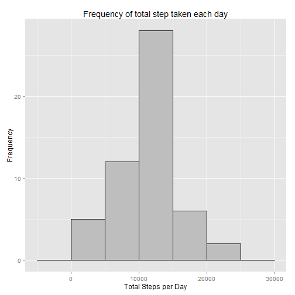
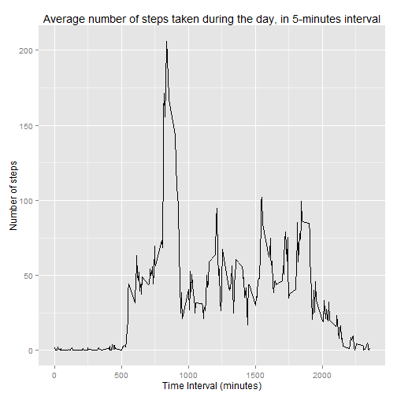
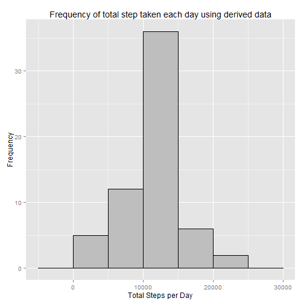
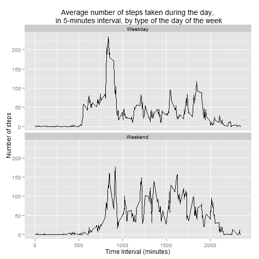

# Reproducible Research Peer Assessment 1

### Download and Loading Dataset

```r
#install.packages(c('ggplot2','data.table'))
library(ggplot2)
library(data.table)
```
  

```r
setInternet2(use = TRUE)
download.file('https://d396qusza40orc.cloudfront.net/repdata%2Fdata%2Factivity.zip','activity.zip')
file=unz("activity.zip",filename='activity.csv')
data=data.table(read.csv(file))
```

### What is mean total number of steps taken per day?

For this part of the assignment, you can ignore the missing values in the dataset.

1) Make a histogram of the total number of steps taken each day
2) Calculate and report the mean and median total number of steps taken per day

#### Histogram of the total number of steps taken each day


```r
#aggregate tot steps per day
steps.day = data[is.na(steps)==FALSE,list(tot_steps = sum(steps,na.rm=TRUE)),by=date]
#plotting
p <-  ggplot(steps.day,aes(x=tot_steps)) +
      geom_histogram(binwidth=5000, fill='grey',colour='black') +
      xlab("Total Steps per Day") +
      ylab("Frequency") + 
      ggtitle("Frequency of total step taken each day")
p
```

 

- Mean of total number of step taken per day is 10,766.19 steps.
- Median of total number of step taken per day is 10,765 steps.

### What is the average daily activity pattern?

**Time series plot of the 5-minute interval (x-axis) and the average number of steps taken, averaged across all days (y-axis)**

```r
# aggregate steps by interval
time_interval <- data[is.na(steps)==FALSE,list(steps = mean(steps,na.rm=TRUE)),by=interval]
#plot
p <-  ggplot(time_interval, aes(x=interval, y=steps)) +
      geom_line() +
      xlab("Time Interval (minutes)") +
      ylab("Number of steps") + 
      ggtitle("Average number of steps taken during the day, in 5-minutes interval")
p
```

 

**The 5-minute interval, on average across all the days in the dataset, that contains the maximum number of step is:**

```r
time_interval[which.max(time_interval$steps)]
```

```
##    interval    steps
## 1:      835 206.1698
```


### Imputing missing values

Note that there are a number of days/intervals where there are missing values (coded as NA). The presence of missing days may introduce bias into some calculations or summaries of the data.

1. Calculate and report the total number of missing values in the dataset (i.e. the total number of rows with NAs)

2. Devise a strategy for filling in all of the missing values in the dataset. The strategy does not need to be sophisticated. For example, you could use the mean/median for that day, or the mean for that 5-minute interval, etc.

3. Create a new dataset that is equal to the original dataset but with the missing data filled in.

4. Make a histogram of the total number of steps taken each day and Calculate and report the mean and median total number of steps taken per day. Do these values differ from the estimates from the first part of the assignment? What is the impact of imputing missing data on the estimates of the total daily number of steps?


```r
#  rows with NA
data.NA <- data[is.na(steps)==TRUE,]
```
**Total number of rows with missing value is 2,304**

```r
#The strategy is filling the data with the average for the same timeframe
# calculation of the missing date
data.filled=merge(data.NA,time_interval,by='interval',all.x=TRUE)
# creation of the new dataset
data.derived=rbind(data[is.na(steps)==FALSE],data.filled[,list(steps=steps.y,date,interval)])
#aggregate tot steps per day for the new table
steps.derived.day = data.derived[is.na(steps)==FALSE,list(tot_steps = sum(steps,na.rm=TRUE)),by=date]
#plotting
p <-  ggplot(steps.derived.day,aes(x=tot_steps)) +
      geom_histogram(binwidth=5000, fill='grey',colour='black') +
      xlab("Total Steps per Day") +
      ylab("Frequency") + 
      ggtitle("Frequency of total step taken each day using derived data")
p
```

 

- The new Mean of total number of step taken per day is 10,766.19 steps.
- The new Median of total number of step taken per day is 10,766.19 steps.

With the new derived data, the mean remains the same and there is slight increase in the median value.


### Are there differences in activity patterns between weekdays and weekends?

1. Create a new factor variable in the dataset with two levels – “weekday” and “weekend” indicating whether a given date is a weekday or weekend day.

2. Make a panel plot containing a time series plot (i.e. type = "l") of the 5-minute interval (x-axis) and the average number of steps taken, averaged across all weekday days or weekend days (y-axis). See the README file in the GitHub repository to see an example of what this plot should look like using simulated data.


```r
# calculating day of the week 
data$weekday<- weekdays(as.Date(data$date, "%Y-%m-%d"))
# Calculating type of day (weekend or weekday)
data$weekday.type <- ifelse(data$weekday %in% c('Saturday','Sunday'),'Weekend','Weekday')

# aggregate steps by interval
time_interval <- data[is.na(steps)==FALSE,list(steps = mean(steps,na.rm=TRUE)),by=list(interval,weekday.type)]
#plot
p <-  ggplot(time_interval, aes(x=interval, y=steps)) +
      geom_line() +
      xlab("Time Interval (minutes)") +
      ylab("Number of steps") + 
      ggtitle("Average number of steps taken during the day,\n in 5-minutes interval, by type of the day of the week") +
      facet_wrap(~ weekday.type, ncol=1)
p
```

 

